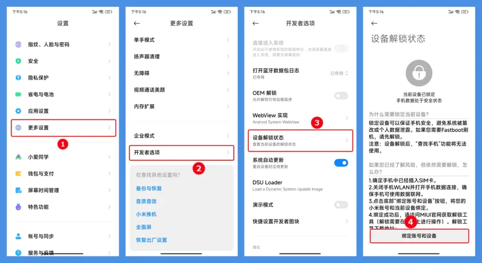
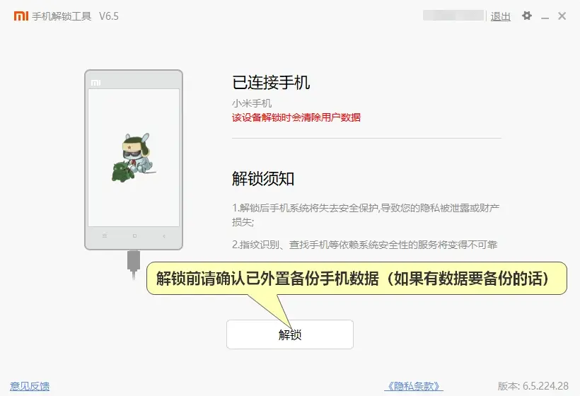
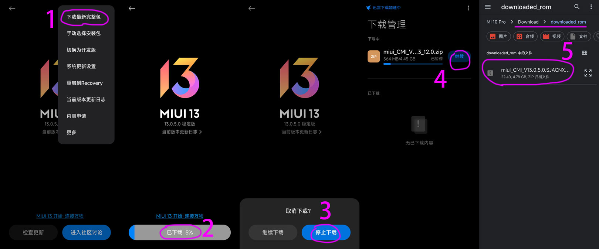

# Inference_on_Snapdragon_8_Gen_2

本文描述了在搭载了骁龙8 Gen 2的手机平台上做深度学习模型推理的整个流程

## 小米解BL锁

BL指Bootloader，在手机安全启动规范中属于较底层的一环，主要用于验证加载对象签名，防止启动第三方ROM或Recovery，避免带来数据安全风险，限制fastboot线刷机。对于合法刷机要求，小米保留BL解锁通道，解锁后可以刷机。

在解锁前，先确认小米账号是否可以解锁（每月最多解锁一台手机，每年最多4台，超过需要更换账号），账号没问题后即可开始解锁步骤：

1. 备份手机数据，解锁会清空数据，新机可忽略。
2. 插入可以首用sim卡，关闭WIFI连接，启用手机数据联网
3. 手机依次点击：设置 -> 我的设备 -> 全部参数 -> 连续点击几次 “MIUI版本”打开-开发者选项
    
     
    <p class="sphinxhide" align="center"><sub>图片来源网络，若有侵权，请联系删除</sub></p>
4. 手机依次点击：设置 -> 更多设置 -> 开发者选项 -> 设备解锁状 -> 定号和设备
   
      
      <p class="sphinxhide" align="center"><sub>图片来源网络，若有侵权，请联系删除</sub></p>
5. 初次绑定手机，需要绑定账号后等待7天，期间不要退出小米账号，以满足解锁条件
  
       
      <p class="sphinxhide" align="center"><sub>图片来源网络，若有侵权，请联系删除</sub></p>
6. 电脑端（Win系统）下载小米BL解锁工具，可到官方下载。解压运行mifash_unlock.exe，按照提示登陆小米账号
7. 手机关机，按住 音量下键+开机键 进入Fastboot模式，然后用USB连接电脑
  
       
      <p class="sphinxhide" align="center"><sub>图片来源网络，若有侵权，请联系删除</sub></p>
8. 识别手机连接后，点击“解锁”按钮，看到BL解锁结果，重启手机，至此成功解锁
   
       
      <p class="sphinxhide" align="center"><sub>图片来源网络，若有侵权，请联系删除</sub></p>
 
## 刷入面具ROOT

小米13pro搭载安卓13系统，ROOT方法看下面操作：
1. 下载官方系统包（这个系统包要与当前使用的系统版本一致，不然会出现刷机崩溃）- 推荐直接从手机下载：下载到1%以上停止 -> 打开下载管理继续下载 -> 下载完成系统包在/Download 目录
   
       
      <p class="sphinxhide" align="center"><sub>图片来源网络，若有侵权，请联系删除</sub></p>
2. 解压系统包，将```img```文件中的```init_boot.img```文件复制到Download目录。注意：如果使用的是其他三方的卡刷包，就要使用需要```payload-dumper-go```将```payload.bin```文件提取出来。
    
       
      <p class="sphinxhide" align="center"><sub>图片来源网络，若有侵权，请联系删除</sub></p>
3. 手机下载并安装```Magisk app```，从官方下载[Magisk](https://github.com/topjohnwu/Magisk/releases)软件，注意不要安装在外置存储上
     打开```Magisk```，选择右上角位置的安装键 -> 选择并修补一个文件 -> 选择```init_boot.img``` -> 开始 -> 修补成功
      
       
      <p class="sphinxhide" align="center"><sub>图片来源网络，若有侵权，请联系删除</sub></p>
4. 修补成功后```Download```目录生成 ```magisk_patch_xxx.img```文件。注意：需要复制文件到其他目录，不然win系统下识别不到。
5. 电脑（win系统）下载[Android SDK 工具包](https://developer.android.com/tools/releases/platform-tools)。下载后解压文件，将 ```magisk_patch_xxx.img```   和   ```init_boot.img ```复制到```platform-tools```文件夹内，注意`init_boot.img`是防止刷机失败恢复系统使用。
6. 手机关机重启并进入```fastboot```模式，使用USB连接电脑。
7. 进入```platform-tools```目录，按住`shift`同时右键点击空白处，选择在此处打开```Powershell```窗口，之后运行如下命令
```
 ###运行刷新命令
 .\fastboot flash init_boot magisk_patch_xxx.img
 
  ### 出现以下信息，镜像成功写入
  Sending 'init_boot' (131072 KB) OKAY [ 3.311s]
  Writing 'init_boot' OKAY [ 0.441s]
  Finished. Total time: 3.794s
  
  ### 完成后运行重启命令
  .\fastboot reboot
```
8. 等待手机开机，```Magisk```显示版本信息证明刷机成功，下方超级用户按钮开启
    
       
      <p class="sphinxhide" align="center"><sub>图片来源网络，若有侵权，请联系删除</sub></p>

## 安装SNPE

```SNPE```是**Qualcomm Snapdragon Neural Processing Engine** 的简称.

```SNPE``` 是**神经网络在骁龙平台上推理**的开发套件，方便开发者在使用高通芯片的设备上加速AI应用。

支持的模型框架：TensorFlow, CAFFE, ONNX, TensorFlowLite

可选择的硬件：CPU，GPU，DSP，HTA，HTP

SNPE的下载地址在: 

> https://developer.qualcomm.com/software/qualcomm-neural-processing-sdk/tools

更新速度较快，每月一版本。目前最新版本为[Qualcomm Neural Processing SDK for Linux v2.10.0](https://developer.qualcomm.com/downloads/qualcomm-neural-processing-sdk-linux-v2100?referrer=node/34505)，注册之后可以下载。

> **Note：** 可以参考官网教程，从环境搭建到Tools usage：https://developer.qualcomm.com/sites/default/files/docs/snpe/index.html

#### 1. 推荐使用Ubuntu 18.04，可以使用docker，本文使用了VMWare虚拟机。

#### 2. 准备Python3.6环境

（1）解压sdk包，全程切换至root操作
```
root@ubuntu:/root/snpe# unzip snpe-2.9.0.4462
root@ubuntu:/root/snpe# cd snpe-2.9.0.4462
```

（2）Python3设置，如果默认python3.6可以跳过此步
```
root@ubuntu:/root/snpe/snpe-2.9.0.4462# apt-get install python3
root@ubuntu:/root/snpe/snpe-2.9.0.4462# update-alternatives --install /usr/bin/python python /usr/bin/python2.7 1
root@ubuntu:/root/snpe/snpe-2.9.0.4462# update-alternatives --install /usr/bin/python python /usr/bin/python3.6 2
root@ubuntu:/root/snpe/snpe-2.9.0.4462# update-alternatives --list python
root@ubuntu:/root/snpe/snpe-2.9.0.4462# update-alternatives --config python
#选择 python3.6
```
（3）检测安装系统包
```
root@ubuntu:/root/snpe/snpe-2.9.0.4462# source bin/dependencies.sh
```
如果以上自动检测安装出错，先安装 'python-dev'， 'wget'， 'zip'， 'libc++-9-dev'
```
root@ubuntu:/root/snpe/snpe-2.9.0.4462# apt-get install python3-dev
root@ubuntu:/root/snpe/snpe-2.9.0.4462# apt-get install wget
root@ubuntu:/root/snpe/snpe-2.9.0.4462# apt-get install zip
root@ubuntu:/root/snpe/snpe-2.9.0.4462# apt-get install libc++-9-dev
```

（4）检测和安装python依赖包，先安装pip
```
root@ubuntu:/root/snpe/snpe-2.9.0.4462# apt-get install python-pip
root@ubuntu:/root/snpe/snpe-2.9.0.4462# source bin/check_python_depends.sh
```
自动检测安装未找到依赖包，按照提示信息依次安装
```
root@ubuntu:/root/snpe/snpe-2.9.0.4462# pip install numpy sphinx scipy matplotlib scikit-image protobuf pyyaml mako
```
（5）添加环境变量

添加SNPE_ROOT环境变量
```
root@ubuntu:/root/snpe/snpe-2.9.0.4462# vim ~/.bashrc
```
在文末添加：
```
export SNPE_ROOT=/root/snpe/snpe-2.9.0.4462
```
激活环境
```
root@ubuntu:/root/snpe/snpe-2.9.0.4462# source ~/.bashrc
```
（6）配置深度学习环境

这里我们配置Tensorflow环境。目前我们不需要NDK，可以先忽略ANDROID_NDK_ROOT设置，后续如果需要编译Native C++ Example的时候再设置。

我们已经设置过SNPE_ROOT，这里我们需要继续设置TENSORFLOW_HOME,  PATH，LD_LIBRARY_PATH以及PYTHONPATH。 SNPE支持TF1.x和2.3，这里使用tf2.3，如果遇到问题可能与tf版本有关
```
root@ubuntu:/root/snpe/snpe-2.9.0.4462# python -m pip install --upgrade pip
root@ubuntu:/root/snpe/snpe-2.9.0.4462# pip install tensorflow==2.3.0
root@ubuntu:/root/snpe/snpe-2.9.0.4462# pip show -f tensorflow | grep Location
##显示包的位置
Location: /usr/local/lib/python3.6/dist-packages
```
设置Tensorflow SNPE 环境
```
root@ubuntu:/root/snpe/snpe-2.9.0.4462# source bin/envsetup.sh -t /usr/local/lib/python3.6/dist-packages/tensorflow/
```
测试是否配置成功，如果打印出```help```信息，则完成配置。
```
root@ubuntu:/root/snpe/snpe-2.9.0.4462# snpe-tensorflow-to-dlc -h
```

## 模型转换及数据准备

#### 1. 准备数据

创建目录准备放置模型及数据，下载TF官方数据集
```
root@ubuntu:/root/snpe/snpe-2.9.0.4462# cd ..
root@ubuntu:/root/snpe# mkdir model/tf_files && cd model
root@ubuntu:/root/snpe/model# curl htp://download.tensorflow.org/example_images/flower_photos.tgz  | tar xz -C tf_files
```
创建样本 （参考此处列出的脚本）
```
root@ubuntu:/root/snpe/model# python random_sample.py tf_files/flower_photos/ samples/
```
将图片转换成raw格式（参考此处列出的脚本）
```
root@ubuntu:/root/snpe/model# python ./toraw.py samples/
root@ubuntu:/root/snpe/model# find samples/ -name *.raw > samples.txt
```

#### 2. 模型转换

使用Mobilenetv2模型，从tensorflow/modle 官方模型库下载模型
```
root@ubuntu:/root/snpe/model# wget https://storage.googleapis.com/mobilenet_v2/checkpoints/mobilenet_v2_1.4_224.tgz
root@ubuntu:/root/snpe/model# tar xzvf mobilenet_v2_1.4_224.tgz
```
使用```snpe-tensorflow-to-dlc```将模型转换成dlc格式
```
root@ubuntu:/root/snpe/model# snpe-tensorflow-to-dlc --input_network ../mobilenet/mobilenet_v2_1.4_224_frozen.pb --input_dim input "1,224,224,3" --out_node MobilenetV2/Predictions/Reshape_1
```
使用quantize工具，dsp需要使用int8以下的量化模型
```
root@ubuntu:/root/snpe/model# snpe-dlc-quantize --input_dlc mobilenet_v2_1.4_224_frozen..dlc --output_dlc mobilenet_v2_1.4_224_frozen_q.dlc --input_list samples.txt
```
## 主机连接手机

此前我们已经取得了小米13pro的root，在unbuntu下使用adb连接android手机
安装android-tools-adb
```
root@ubuntu:/root# apt update
root@ubuntu:/root# apt install android-tools-adb android-tools-fastboot
```
启动```adb```服务
```
root@ubuntu:/root# adb start-server
```

手机开放USB调试，并使用USB线连接至Linux主机

    
      <p class="sphinxhide" align="center"><sub>图片来源网络，若有侵权，请联系删除</sub></p>
     

 检查是否以连接手机
 终端可以看到输出，报考手机信息
 ```
root@ubuntu:/root# adb devices
## 显示
List of devices attached
3a7c328c	device
```
使用如下命令登陆手机
 ```
root@ubuntu:/root#  adb shell
```

首次登陆需要magisk授予root权限

   
 

## 手机部署SNPE以及运行推理

#### 1. 将二进制文件推送至手机
SNPE SDK提供了Linux以及Android的二进制文件在如下目录中：
```
$SNPE_ROOT/bin/x86_64-linux-clang
$SNPE_ROOT/bin/arm-android-clang8.0
$SNPE_ROOT/bin/aarch64-android-clang8.0
$SNPE_ROOT/bin/aarch64-oe-linux-gcc8.2
$SNPE_ROOT/bin/aarch64-oe-linux-gcc9.3
$SNPE_ROOT/bin/aarch64-ubuntu-gcc7.5
```
我们在安卓手机上运行，如果是```architecture: armeabi-v7a```选择```arm-android-clang8.0``` ；如果是```arm64-v8a```，选择```aarch64-android-clang8.0```，小米13pro是后一种架构，我们选择```aarch64-android-clang8.0```下的二进制文件
使用以下命令，将必要的```lib```  和  ```bin```推到安卓机上
```
root@ubuntu:/root# export SNPE_TARGET_ARCH=arm-android-clang8.0
root@ubuntu:/root# export SNPE_TARGET_STL=libc++_shared.so

root@ubuntu:/root# adb shell "mkdir -p /data/local/tmp/snpeexample/$SNPE_TARGET_ARCH/bin"
root@ubuntu:/root# adb shell "mkdir -p /data/local/tmp/snpeexample/$SNPE_TARGET_ARCH/lib"
root@ubuntu:/root# adb shell "mkdir -p /data/local/tmp/snpeexample/dsp/lib"

root@ubuntu:/root# adb push $SNPE_ROOT/lib/$SNPE_TARGET_ARCH/$SNPE_TARGET_STL /data/local/tmp/snpeexample/$SNPE_TARGET_ARCH/lib
root@ubuntu:/root# adb push $SNPE_ROOT/lib/$SNPE_TARGET_ARCH/*.so /data/local/tmp/snpeexample/$SNPE_TARGET_ARCH/lib
root@ubuntu:/root# adb push $SNPE_ROOT/lib/dsp/*.so /data/local/tmp/snpeexample/dsp/lib
root@ubuntu:/root# adb push $SNPE_ROOT/bin/$SNPE_TARGET_ARCH/snpe-net-run /data/local/tmp/snpeexample/$SNPE_TARGET_ARCH/bin
root@ubuntu:/root# adb push $SNPE_ROOT/bin/$SNPE_TARGET_ARCH/snpe-throughput-net-run /data/local/tmp/snpeexample/$SNPE_TARGET_ARCH/bin
```

#### 2. 将数据及模型推送至手机
```
root@ubuntu:/root# cd snpe/model

root@ubuntu:/root/snpe/model# adb shell "mkdir -p /data/local/tmp/mobilenetv2"

root@ubuntu:/root/snpe/model# adb push samples /data/local/tmp/mobilenetv2
root@ubuntu:/root/snpe/model# adb push samples.txt /data/local/tmp/mobilenetv2
root@ubuntu:/root/snpe/model# adb push mobilenet_v2_1.4_224_frozen.dlc /data/local/tmp/mobilenetv2s /data/local/tmp/mobilenetv2
root@ubuntu:/root/snpe/model# adb push mobilenet_v2_1.4_224_frozen_q.dlc /data/local/tmp/mobilenetv2
```
#### 3. 在安卓机上设置环境变量
进入adb shell并切换到root，注意每次进入adb shell 都需要重新设置环境
```
root@ubuntu:/root/snpe/model# adb shell

##手机root标志为“#”
nuwa:/ $ su root
nuwa:/ #

nuwa:/ # export SNPE_TARGET_ARCH=aarch64-android-clang8.0
nuwa:/ # export LD_LIBRARY_PATH=$LD_LIBRARY_PATH:/data/local/tmp/snpeexample/$SNPE_TARGET_ARCH/lib
nuwa:/ # export PATH=$PATH:/data/local/tmp/snpeexample/$SNPE_TARGET_ARCH/bin

### DSP LIB的路径每个手机不同，参考官网
nuwa# export ADSP_LIBRARY_PATH="/data/local/tmp/snpeexample/dsp/lib;/system/vendor/lib/rfsa/adsp"

### 测试环境
nuwa:/ # snpe-net-run -h

```
#### 4. 运行推理及输出

推理结果默认保存在output中，运行时制定```--output_dir```参数，指定不同路径
（1）使用CPU推理及输出
```
nuwa:/ # cd /data/local/tmp/mobilenetv2

## 推理结果会保存到指定目录下
nuwa:/ # snpe-net-run --container mobilenet_v2_1.4_224_frozen.dlc --input_list samples --output_dir cpu

## 会在屏幕打印出信息
nuwa:/ # snpe-throughput-net-run --container mobilenet_v2_1.4_224_frozen.dlc --duration 10 --perf_profile burst --use_cpu

[Thread 0 - cpu_float32] 43.6138 infs/sec - Number of images processed: 437 - Build time: 48593 microseconds - Elapsed time: 10020649 microseconds - Real time: 10019761 microseconds - Teardown time: 8047 microseconds - Batch : 1
Total throughput: 43.6138 infs/sec
```

（2）使用GPU推理及输出
```
## 推理结果会保存到指定目录下
nuwa:/ # snpe-net-run --container mobilenet_v2_1.4_224_frozen.dlc --input_list samples --output_dir gpu --use_gpu

## 会在屏幕打印出信息
nuwa:/ # snpe-throughput-net-run --container mobilenet_v2_1.4_224_frozen.dlc --duration 10 --perf_profile burst --use_gpu

[Thread 0 - gpu_float32_16_hybrid] 120.149 infs/sec - Number of images processed: 1077 - Build time: 875167 microseconds - Elapsed time: 10001786 microseconds - Real time: 9998828 microseconds - Teardown time: 24321 microseconds - Batch : 1
Total throughput: 120.149 infs/sec
```
（3）使用DSP推理及输出
```
## 推理结果会保存到指定目录下
nuwa:/ # snpe-net-run --container mobilenet_v2_1.4_224_frozen_q.dlc --input_list samples --output_dir dsp --use_dsp

## 会在屏幕打印出信息
nuwa:/ # snpe-throughput-net-run --container mobilenet_v2_1.4_224_frozen.dlc --duration 10 --perf_profile burst --use_dsp

[Thread 0 - dsp_fixed8_tf] 1581.96 infs/sec - Number of images processed: 15803 - Build time: 657077 microseconds - Elapsed time: 10000188 microseconds - Real time: 9989524 microseconds - Teardown time: 10750 microseconds - Batch : 1
Total throughput: 1581.96 infs/sec     
```
#### 5.将推理结果拉回主机并分析

将运行结果从安卓机pull到host
```
root@ubuntu:/root# cd snpe/model
root@ubuntu:/root/snpe/model# adb pull /data/local/tmp/mobilenetv2/cpu .
root@ubuntu:/root/snpe/model# adb pull /data/local/tmp/mobilenetv2/gpu .
root@ubuntu:/root/snpe/model# adb pull /data/local/tmp/mobilenetv2/dsp .

```
使用分析工具做结果分析
CPU
```
root@ubuntu:/root# cd snpe/snpe-2.9.0.4462/bin/x86_64-linux-clang
root@ubuntu:/root/snpe/snpe-2.9.0.4462/bin/x86_64-linux-clang# ./snpe-diagview --input_log /root/snpe/model/cpu/SNPEDiag_0.log

Interpreting file serialized with Flatbuffer
CREATE NETWORK: 25547
Log File Created: Thu May 25 10:39:50 2023
Time Scale: 1e-06
Epoch Timestamp: 1684982390553962 Steady Clock Timestamp: 133813288514
Software library version: 2.9.0.4462

Dnn Runtime Load/Deserialize/Create/De-Init Statistics:
--------------------------------------------------
Load: 149 us
Deserialize: 15997 us
Create: 28905 us

Init: 48856 us
De-Init: 6699 us

Create Network(s): 25547 us
RPC Init Time: 0 NONE
Snpe Accelerator Init Time: 0 NONE
Accelerator Init Time: 0 NONE

Average SNPE Statistics:
------------------------------
Total Inference Time: 26458 us
Forward Propagate Time: 26448 us
RPC Execute Time: 0 us
Snpe Accelerator Time: 0 us
Accelerator Time: 0 us
Misc Accelerator Time: 0 us

Layer Times: 
---------------
0: 1419 us : CPU
..
..
100: 21 us : CPU
```

GPU
```
root@ubuntu:/root/snpe/snpe-2.9.0.4462/bin/x86_64-linux-clang# ./snpe-diagview --input_log /root/snpe/model/gpu/SNPEDiag_0.log

Interpreting file serialized with Flatbuffer
CREATE NETWORK: 868051
Log File Created: Thu May 25 10:40:18 2023
Time Scale: 1e-06
Epoch Timestamp: 1684982418344254 Steady Clock Timestamp: 133841078806
Software library version: 2.9.0.4462

Dnn Runtime Load/Deserialize/Create/De-Init Statistics:
--------------------------------------------------
Load: 237 us
Deserialize: 27144 us
Create: 871138 us

Init: 903746 us
De-Init: 24806 us

Create Network(s): 868051 us
RPC Init Time: 0 NONE
Snpe Accelerator Init Time: 0 NONE
Accelerator Init Time: 0 NONE

Average SNPE Statistics:
------------------------------
Total Inference Time: 11676 us
Forward Propagate ..Time: 11642 us
RPC Execute Time: 0 us
Snpe Accelerator Time: 0 us
Accelerator Time: 0 us
Misc Accelerator Time: 0 us

Layer Times: 
---------------
0: 144 us : GPU
..
..
100: 46 us : GPU
```

DSP
```
root@ubuntu:/root/snpe/snpe-2.9.0.4462/bin/x86_64-linux-clang# ./snpe-diagview --input_log /root/snpe/model/dsp/SNPEDiag_0.log

Interpreting file serialized with Flatbuffer
CREATE NETWORK: 254629
Log File Created: Thu May 25 10:46:42 2023
Time Scale: 1e-06
Epoch Timestamp: 1684982802617356 Steady Clock Timestamp: 134225351908
Software library version: 2.9.0.4462

Dnn Runtime Load/Deserialize/Create/De-Init Statistics:
--------------------------------------------------
Load: 369 us
Deserialize: 15037 us
Create: 264748 us

Init: 283050 us
De-Init: 14744 us

Create Network(s): 254629 us
RPC Init Time: 3212 us
Snpe Accelerator Init Time: 3073 us
Accelerator Init Time: 3039 us

Average SNPE Statistics:
------------------------------
Total Inference Time: 3318 us
Forward Propagate Time: 3244 us
RPC Execute Time: 1777 us
Snpe Accelerator Time: 1735 us
Accelerator Time: 603 us
Misc Accelerator Time: 0 us

Layer Times: 
---------------
0: 0 cycles : DSP
1: 162014 cycles : DSP
..
..
100: 18292 cycles : DSP
```
