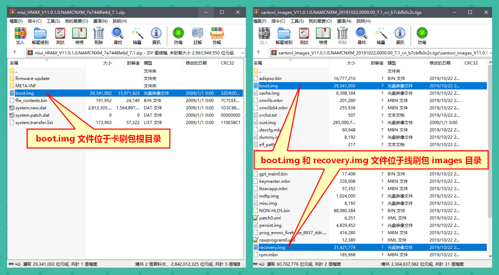

# Inference_on_Snapdragon_8_Gen_2

This article describes the entire process of deep learning model inference on a mobile platform equipped with Snapdragon 8 Gen 2.

## Unlock BL of XiaoMi

BL refers to Bootloader, which is a lower level of the mobile phone security startup specification. It is mainly used to verify the signature of the loaded object, prevent third-party ROM or Recovery from starting, avoid data security risks, and limit fastboot thread flash. For legal flash requirements, Xiaomi reserves the BL unlocking channel, which can be used for flashing after unlocking.

Before unlocking, first confirm whether the Xiaomi account can be unlocked (at most one phone can be unlocked each month, and at most four phones can be unlocked each year. If it exceeds the limit, the account needs to be changed). Once the account is fine, the unlocking steps can begin:

1. Back up phone data. Unlocking will clear the data, which can be ignored for new devices.

2. Insert the SIM card for the first time, close the WIFI connection, and enable mobile data networking.

3. Click on the phone in sequence: Settings ->My Device ->All Parameters ->Multiple consecutive clicks on "MIUI Version" to open - Developer Options.

     
    <p class="sphinxhide" align="center"><sub>The image source from network. If there is any infringement, please contact to delete</sub></p>
4. On the phone, click on: Settings ->More Settings ->Developer Options ->Device Unlock Status ->Registration and Device.

      
      <p class="sphinxhide" align="center"><sub>The image source from network. If there is any infringement, please contact to delete</sub></p>
      
5. For the first time binding a phone, it is necessary to wait for 7 days after binding the account. During this period, do not exit the Xiaomi account to meet the unlocking conditions.
  
       
      <p class="sphinxhide" align="center"><sub>The image source from network. If there is any infringement, please contact to delete</sub></p>
6. Download the Xiaomi BL unlocking tool on the computer (Win system), which can be downloaded from the official website. Decompress and run mifash_ Unlock. exe, follow the prompts to log in to Xiaomi account.

7. Turn off the phone, press and hold the volume down button and power on button to enter Fastboot mode, and then connect to the computer with USB.
  
       
      <p class="sphinxhide" align="center"><sub>The image source from network. If there is any infringement, please contact to delete</sub></p>
8. After identifying the phone connection, click the "Unlock" button to see the BL unlocking result. Restart the phone and successfully unlock it.
 
       
      <p class="sphinxhide" align="center"><sub>The image source from network. If there is any infringement, please contact to delete</sub></p>
 
## Flash in MASK ROOT

The Xiaomi 13pro is equipped with the Android 13 system, and the ROOT method is as follows:
1. Download the official system package (this system package should be consistent with the current system version, otherwise there may be a crash) - It is recommended to download directly from your phone: Stop downloading when it reaches 1% or above ->Open download management to continue downloading ->Download the complete system package in the/Download directory.

       
      <p class="sphinxhide" align="center"><sub>The image source from network. If there is any infringement, please contact to delete</sub></p>
2. Unzip the system package and copy the ```init_boot.img``` from the ```img``` file to the Download directory. Note: If using a third-party card flash package, it is necessary to extract the ```payload-dumper-go``` file from the ```payload. bin``` file.     
    
       
      <p class="sphinxhide" align="center"><sub>The image source from network. If there is any infringement, please contact to delete</sub></p>
3. Download and install the ```Magisk app``` on your phone, official site [Magisk](https://github.com/topjohnwu/Magisk/releases), be careful not to install on external storage
Open ```Magisk```, select the installation button in the upper right corner -> select and patch a file -> select ```init_boot.img``` ->Start ->Repair successful.

       
      <p class="sphinxhide" align="center"><sub>The image source from network. If there is any infringement, please contact to delete</sub></p>
4. After successful patching, ```magic_patch_xxx.img```file is generated in ```Download``` directory. Notes: Need to copy the file to another directory, otherwise it will not be recognized in the Win system.
5. Download Win [Android SDK toolkit](https://developer.android.com/tools/releases/platform-tools). After downloading, unzip the file and copy the ```magic_patch_xxx.img``` and ```init_boot.img``` to ```platform tools``` folder. Note:```init_boot.img```is used to restart when flashing failed.

6. Shut down and restart the phone and enter the 'fastboot' mode, using USB to connect to the computer.

7. Enter the ```platform tools``` directory, hold down ```shift``` while right-clicking on the blank space, choose to open the ```Powershell``` , and then run the following command.
```
 ###run fastboot falsh command
 .\fastboot flash init_boot magisk_patch_xxx.img
 
  ### show the following infos, flash successfully
  Sending 'init_boot' (131072 KB) OKAY [ 3.311s]
  Writing 'init_boot' OKAY [ 0.441s]
  Finished. Total time: 3.794s
  
  ### reboot
  .\fastboot reboot
```
8. Wait for the phone to turn on, ```Magisk``` displays version information to prove successful startup, and the super user button below is turned on
    
       
      <p class="sphinxhide" align="center"><sub>The image source from network. If there is any infringement, please contact to delete</sub></p>

## Install SNPE

```SNPE``` is **Qualcomm Snapdragon Neural Processing Engine**.

```SNPE``` is **The development kit for neural network inference on Snapdragon platform** which facilitates developers to accelerate AI applications on Qualcomm devices.

Supported frameworks：TensorFlow, CAFFE, ONNX, TensorFlowLite

Supported Devices：CPU，GPU，DSP，HTA，HTP

SNPE Download site: 

> https://developer.qualcomm.com/software/qualcomm-neural-processing-sdk/tools

version update each month. This article used[Qualcomm Neural Processing SDK for Linux v2.10.0](https://developer.qualcomm.com/downloads/qualcomm-neural-processing-sdk-linux-v2100?referrer=node/34505)，Download after registration.

> **Note：** refer to the official tutorial, from environment setup to Tools usage：https://developer.qualcomm.com/sites/default/files/docs/snpe/index.html

#### 1. It is recommended to use Ubuntu 18.04, Local or Docker. This article uses a VMWare env

#### 2. Python3.6 Env

(1) Unzip snpe (All operation with root)
```
root@ubuntu:/root/snpe# unzip snpe-2.9.0.4462
root@ubuntu:/root/snpe# cd snpe-2.9.0.4462
```

(2) Setup Python3. Skip the step if python3.6 is the default
```
root@ubuntu:/root/snpe/snpe-2.9.0.4462# apt-get install python3
root@ubuntu:/root/snpe/snpe-2.9.0.4462# update-alternatives --install /usr/bin/python python /usr/bin/python2.7 1
root@ubuntu:/root/snpe/snpe-2.9.0.4462# update-alternatives --install /usr/bin/python python /usr/bin/python3.6 2
root@ubuntu:/root/snpe/snpe-2.9.0.4462# update-alternatives --list python
root@ubuntu:/root/snpe/snpe-2.9.0.4462# update-alternatives --config python
#Choose python3.6
```
(3) Checkout the system packages
```
root@ubuntu:/root/snpe/snpe-2.9.0.4462# source bin/dependencies.sh
```
install 'python-dev'， 'wget'， 'zip'， 'libc++-9-dev' if there have errors during the above check
```
root@ubuntu:/root/snpe/snpe-2.9.0.4462# apt-get install python3-dev
root@ubuntu:/root/snpe/snpe-2.9.0.4462# apt-get install wget
root@ubuntu:/root/snpe/snpe-2.9.0.4462# apt-get install zip
root@ubuntu:/root/snpe/snpe-2.9.0.4462# apt-get install libc++-9-dev
```

(4) Install pip and python dependencies
```
root@ubuntu:/root/snpe/snpe-2.9.0.4462# apt-get install python-pip
root@ubuntu:/root/snpe/snpe-2.9.0.4462# source bin/check_python_depends.sh
```
follow the prompts to install the missing dependencies
```
root@ubuntu:/root/snpe/snpe-2.9.0.4462# pip install numpy sphinx scipy matplotlib scikit-image protobuf pyyaml mako
```
(5) Add environment variables

  SNPE_ROOT env
```
root@ubuntu:/root/snpe/snpe-2.9.0.4462# vim ~/.bashrc
```
  Add at the last：
```
  export SNPE_ROOT=/root/snpe/snpe-2.9.0.4462
```
  Active the env
```
root@ubuntu:/root/snpe/snpe-2.9.0.4462# source ~/.bashrc
```
(6) Configure DL env

  Setup the Tensorflow environment. At present, we do not need NDK, we can ignore ANDROID for now and NDK would be used later if compiling Native C++Example.
  Set TENSORFLOW_HOME,  PATH，LD_LIBRARY_PATH and PYTHONPATH. SNPE support TF1.x and 2.3，we use tf2.3.
```
root@ubuntu:/root/snpe/snpe-2.9.0.4462# python -m pip install --upgrade pip
root@ubuntu:/root/snpe/snpe-2.9.0.4462# pip install tensorflow==2.3.0
root@ubuntu:/root/snpe/snpe-2.9.0.4462# pip show -f tensorflow | grep Location
##show the tf location
location: /usr/local/lib/python3.6/dist-packages
```
  Set Tensorflow SNPE env
```
root@ubuntu:/root/snpe/snpe-2.9.0.4462# source bin/envsetup.sh -t /usr/local/lib/python3.6/dist-packages/tensorflow/
```
  Test，it would be successfully if show ```help``` info
```
root@ubuntu:/root/snpe/snpe-2.9.0.4462# snpe-tensorflow-to-dlc -h
```

## Model conversion and data preparation

#### 1. Data preparation

Create the directory and dowloadn the tf official dataset
```
root@ubuntu:/root/snpe/snpe-2.9.0.4462# cd ..
root@ubuntu:/root/snpe# mkdir model/tf_files && cd model
root@ubuntu:/root/snpe/model# curl htp://download.tensorflow.org/example_images/flower_photos.tgz  | tar xz -C tf_files
```
Create samples
```
root@ubuntu:/root/snpe/model# python random_sample.py tf_files/flower_photos/ samples/
```
Change the samples to raw format
```
root@ubuntu:/root/snpe/model# python ./toraw.py samples/
root@ubuntu:/root/snpe/model# find samples/ -name *.raw > samples.txt
```

#### 2. Model conversion

Download the Mobilenetv2 from tensorflow/modle hub
```
root@ubuntu:/root/snpe/model# wget https://storage.googleapis.com/mobilenet_v2/checkpoints/mobilenet_v2_1.4_224.tgz
root@ubuntu:/root/snpe/model# tar xzvf mobilenet_v2_1.4_224.tgz
```
Use```snpe-tensorflow-to-dlc```to convert the model to dlc format
```
root@ubuntu:/root/snpe/model# snpe-tensorflow-to-dlc --input_network ../mobilenet/mobilenet_v2_1.4_224_frozen.pb --input_dim input "1,224,224,3" --out_node MobilenetV2/Predictions/Reshape_1
```
Quantization
```
root@ubuntu:/root/snpe/model# snpe-dlc-quantize --input_dlc mobilenet_v2_1.4_224_frozen..dlc --output_dlc mobilenet_v2_1.4_224_frozen_q.dlc --input_list samples.txt
```
## Host connected to device

Previously, we have obtained the root of Xiaomi 13pro, and used adb to connct to Android device with Ubuntu host.
Install android-tools-adb
```
root@ubuntu:/root# apt update
root@ubuntu:/root# apt install android-tools-adb android-tools-fastboot
```
Start```adb```service
```
root@ubuntu:/root# adb start-server
```

Permit USB debug and connet to Linux host with USB

    
      <p class="sphinxhide" align="center"><sub>The image source from network. If there is any infringement, please contact to delete</sub></p>
     

Check if the device is connected
The terminal can see the output
 ```
root@ubuntu:/root# adb devices
## show
List of devices attached
3a7c328c	device
```
Login the device
 ```
root@ubuntu:/root#  adb shell
```

First login requires magisk root permission

   
 

## Deploy SNPE on the device and run inference

#### 1. Push the binaries to the device
SNPE SDK provides Linux and Android binaries(The fold name may be not the same in different snpe version)：
```
$SNPE_ROOT/bin/x86_64-linux-clang
$SNPE_ROOT/bin/arm-android-clang8.0
$SNPE_ROOT/bin/aarch64-android-clang8.0
$SNPE_ROOT/bin/aarch64-oe-linux-gcc8.2
$SNPE_ROOT/bin/aarch64-oe-linux-gcc9.3
$SNPE_ROOT/bin/aarch64-ubuntu-gcc7.5
```
If the device is ```architecture: armeabi-v7a```, choose```arm-android-clang8.0``` ；or ```arm64-v8a``` choose ```aarch64-android-clang8.0```. We choose the binares from ```aarch64-android-clang8.0```, because the Xiaomi 13pro is the second architecture.
Push ```lib```  和  ```bin``` to the device
```
root@ubuntu:/root# export SNPE_TARGET_ARCH=arm-android-clang8.0
root@ubuntu:/root# export SNPE_TARGET_STL=libc++_shared.so

root@ubuntu:/root# adb shell "mkdir -p /data/local/tmp/snpeexample/$SNPE_TARGET_ARCH/bin"
root@ubuntu:/root# adb shell "mkdir -p /data/local/tmp/snpeexample/$SNPE_TARGET_ARCH/lib"
root@ubuntu:/root# adb shell "mkdir -p /data/local/tmp/snpeexample/dsp/lib"

root@ubuntu:/root# adb push $SNPE_ROOT/lib/$SNPE_TARGET_ARCH/$SNPE_TARGET_STL /data/local/tmp/snpeexample/$SNPE_TARGET_ARCH/lib
root@ubuntu:/root# adb push $SNPE_ROOT/lib/$SNPE_TARGET_ARCH/*.so /data/local/tmp/snpeexample/$SNPE_TARGET_ARCH/lib
root@ubuntu:/root# adb push $SNPE_ROOT/lib/dsp/*.so /data/local/tmp/snpeexample/dsp/lib
root@ubuntu:/root# adb push $SNPE_ROOT/bin/$SNPE_TARGET_ARCH/snpe-net-run /data/local/tmp/snpeexample/$SNPE_TARGET_ARCH/bin
root@ubuntu:/root# adb push $SNPE_ROOT/bin/$SNPE_TARGET_ARCH/snpe-throughput-net-run /data/local/tmp/snpeexample/$SNPE_TARGET_ARCH/bin
```

#### 2. Push the model and data to the device
```
root@ubuntu:/root# cd snpe/model

root@ubuntu:/root/snpe/model# adb shell "mkdir -p /data/local/tmp/mobilenetv2"

root@ubuntu:/root/snpe/model# adb push samples /data/local/tmp/mobilenetv2
root@ubuntu:/root/snpe/model# adb push samples.txt /data/local/tmp/mobilenetv2
root@ubuntu:/root/snpe/model# adb push mobilenet_v2_1.4_224_frozen.dlc /data/local/tmp/mobilenetv2s /data/local/tmp/mobilenetv2
root@ubuntu:/root/snpe/model# adb push mobilenet_v2_1.4_224_frozen_q.dlc /data/local/tmp/mobilenetv2
```
#### 3. Set the environment on the device
Enter the adb shell and switch to root. Note: Every time you enter the adb shell, you need to reset the environment
```
root@ubuntu:/root/snpe/model# adb shell

##root symbol on the device is “#”
nuwa:/ $ su root
nuwa:/ #

nuwa:/ # export SNPE_TARGET_ARCH=aarch64-android-clang8.0
nuwa:/ # export LD_LIBRARY_PATH=$LD_LIBRARY_PATH:/data/local/tmp/snpeexample/$SNPE_TARGET_ARCH/lib
nuwa:/ # export PATH=$PATH:/data/local/tmp/snpeexample/$SNPE_TARGET_ARCH/bin

### The path of DSP LIB is different for each device, please refer to the official website
nuwa# export ADSP_LIBRARY_PATH="/data/local/tmp/snpeexample/dsp/lib;/system/vendor/lib/rfsa/adsp"

### Test
nuwa:/ # snpe-net-run -h

```
#### 4. Reference and throughput

推理结果默认保存在output中，运行时制定```--output_dir```参数，指定不同路径
（1）CPU
```
nuwa:/ # cd /data/local/tmp/mobilenetv2

## The results will be saved to the specified directory
nuwa:/ # snpe-net-run --container mobilenet_v2_1.4_224_frozen.dlc --input_list samples --output_dir cpu

## Printed output
nuwa:/ # snpe-throughput-net-run --container mobilenet_v2_1.4_224_frozen.dlc --duration 10 --perf_profile burst --use_cpu

[Thread 0 - cpu_float32] 43.6138 infs/sec - Number of images processed: 437 - Build time: 48593 microseconds - Elapsed time: 10020649 microseconds - Real time: 10019761 microseconds - Teardown time: 8047 microseconds - Batch : 1
Total throughput: 43.6138 infs/sec
```

（2）GPU
```
## The results will be saved to the specified directory
nuwa:/ # snpe-net-run --container mobilenet_v2_1.4_224_frozen.dlc --input_list samples --output_dir gpu --use_gpu

## Printed output
nuwa:/ # snpe-throughput-net-run --container mobilenet_v2_1.4_224_frozen.dlc --duration 10 --perf_profile burst --use_gpu

[Thread 0 - gpu_float32_16_hybrid] 120.149 infs/sec - Number of images processed: 1077 - Build time: 875167 microseconds - Elapsed time: 10001786 microseconds - Real time: 9998828 microseconds - Teardown time: 24321 microseconds - Batch : 1
Total throughput: 120.149 infs/sec
```
（3）DSP
```
## The results will be saved to the specified directory
nuwa:/ # snpe-net-run --container mobilenet_v2_1.4_224_frozen_q.dlc --input_list samples --output_dir dsp --use_dsp

## Printed output
nuwa:/ # snpe-throughput-net-run --container mobilenet_v2_1.4_224_frozen.dlc --duration 10 --perf_profile burst --use_dsp

[Thread 0 - dsp_fixed8_tf] 1581.96 infs/sec - Number of images processed: 15803 - Build time: 657077 microseconds - Elapsed time: 10000188 microseconds - Real time: 9989524 microseconds - Teardown time: 10750 microseconds - Batch : 1
Total throughput: 1581.96 infs/sec     
```
#### 5.Pull the inference results back to the host and analyze them

Pull from the device to host
```
root@ubuntu:/root# cd snpe/model
root@ubuntu:/root/snpe/model# adb pull /data/local/tmp/mobilenetv2/cpu .
root@ubuntu:/root/snpe/model# adb pull /data/local/tmp/mobilenetv2/gpu .
root@ubuntu:/root/snpe/model# adb pull /data/local/tmp/mobilenetv2/dsp .

```
Result analysis with snpe tool
CPU
```
root@ubuntu:/root# cd snpe/snpe-2.9.0.4462/bin/x86_64-linux-clang
root@ubuntu:/root/snpe/snpe-2.9.0.4462/bin/x86_64-linux-clang# ./snpe-diagview --input_log /root/snpe/model/cpu/SNPEDiag_0.log

Interpreting file serialized with Flatbuffer
CREATE NETWORK: 25547
Log File Created: Thu May 25 10:39:50 2023
Time Scale: 1e-06
Epoch Timestamp: 1684982390553962 Steady Clock Timestamp: 133813288514
Software library version: 2.9.0.4462

Dnn Runtime Load/Deserialize/Create/De-Init Statistics:
--------------------------------------------------
Load: 149 us
Deserialize: 15997 us
Create: 28905 us

Init: 48856 us
De-Init: 6699 us

Create Network(s): 25547 us
RPC Init Time: 0 NONE
Snpe Accelerator Init Time: 0 NONE
Accelerator Init Time: 0 NONE

Average SNPE Statistics:
------------------------------
Total Inference Time: 26458 us
Forward Propagate Time: 26448 us
RPC Execute Time: 0 us
Snpe Accelerator Time: 0 us
Accelerator Time: 0 us
Misc Accelerator Time: 0 us

Layer Times: 
---------------
0: 1419 us : CPU
..
..
100: 21 us : CPU
```

GPU
```
root@ubuntu:/root/snpe/snpe-2.9.0.4462/bin/x86_64-linux-clang# ./snpe-diagview --input_log /root/snpe/model/gpu/SNPEDiag_0.log

Interpreting file serialized with Flatbuffer
CREATE NETWORK: 868051
Log File Created: Thu May 25 10:40:18 2023
Time Scale: 1e-06
Epoch Timestamp: 1684982418344254 Steady Clock Timestamp: 133841078806
Software library version: 2.9.0.4462

Dnn Runtime Load/Deserialize/Create/De-Init Statistics:
--------------------------------------------------
Load: 237 us
Deserialize: 27144 us
Create: 871138 us

Init: 903746 us
De-Init: 24806 us

Create Network(s): 868051 us
RPC Init Time: 0 NONE
Snpe Accelerator Init Time: 0 NONE
Accelerator Init Time: 0 NONE

Average SNPE Statistics:
------------------------------
Total Inference Time: 11676 us
Forward Propagate ..Time: 11642 us
RPC Execute Time: 0 us
Snpe Accelerator Time: 0 us
Accelerator Time: 0 us
Misc Accelerator Time: 0 us

Layer Times: 
---------------
0: 144 us : GPU
..
..
100: 46 us : GPU
```

DSP
```
root@ubuntu:/root/snpe/snpe-2.9.0.4462/bin/x86_64-linux-clang# ./snpe-diagview --input_log /root/snpe/model/dsp/SNPEDiag_0.log

Interpreting file serialized with Flatbuffer
CREATE NETWORK: 254629
Log File Created: Thu May 25 10:46:42 2023
Time Scale: 1e-06
Epoch Timestamp: 1684982802617356 Steady Clock Timestamp: 134225351908
Software library version: 2.9.0.4462

Dnn Runtime Load/Deserialize/Create/De-Init Statistics:
--------------------------------------------------
Load: 369 us
Deserialize: 15037 us
Create: 264748 us

Init: 283050 us
De-Init: 14744 us

Create Network(s): 254629 us
RPC Init Time: 3212 us
Snpe Accelerator Init Time: 3073 us
Accelerator Init Time: 3039 us

Average SNPE Statistics:
------------------------------
Total Inference Time: 3318 us
Forward Propagate Time: 3244 us
RPC Execute Time: 1777 us
Snpe Accelerator Time: 1735 us
Accelerator Time: 603 us
Misc Accelerator Time: 0 us

Layer Times: 
---------------
0: 0 cycles : DSP
1: 162014 cycles : DSP
..
..
100: 18292 cycles : DSP
```
